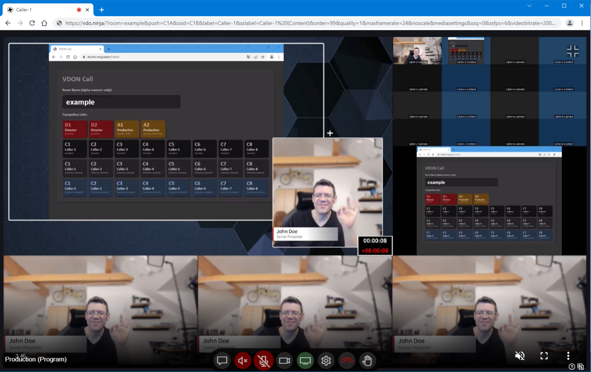
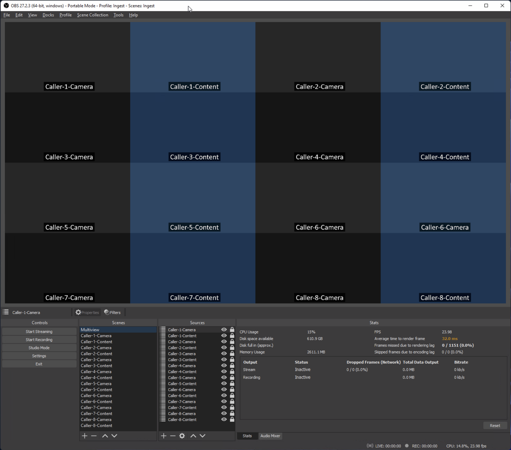

VDON Call
=========

This is remote caller ingest solution for video productions, based on
the awesome [VDO.Ninja](https://vdo.ninja) WebRTC-based video streaming
facility.

Motivation
----------

Its name is inspired by [vMix Call](https://www.vmix.com/products/vmix-call.aspx),
the great but weaker facility it can substitute in practice. The
motivation and primary killer feature of VDON Call, in contrast to the
otherwise also awesome vMix Call, is that the callers can ingest their
camera and content in parallel without having to fiddle around with two
independent Browser tabs and that this dual-ingest approach is available
for 8 callers in total instead of just 4 (notice that vMix Call supports
a maximum of 8 incoming video streams only). The resulting ingested
video streams are available as NDI streams on the local network and can
be consumed (on a separate computer) with a video mixing software like
vMix or OBS Studio.

Constraints
-----------

The underlying VDO.Ninja parameterization is very opinionated and
heavily optimized for a total of 16+1 video streams, to allow one to
ingest up to 8 callers with their camera and shared content (screen or
window) into the video production and to provide a return feed from the
video production back to the callers. The callers can hear but not see
each other, except the provided return feed is some sort of multiview
and shows all callers.

There are two particular bottlenecks in this approach, which result
in heavy constraints on the particular VDO.Ninja parameters:

1. The caller receiver-side is an OBS Studio, acting as a WebRTC-to-NDI
   gateway and has to run on a medium gaming PC (Intel Core i7 11700KF,
   NVIDIA RTX 3070Ti, 32GB RAM) with just about a maximum of overall
   80% resource utilization. As a result, the callers camera use 720p24
   and a bitrate of 2000 kbps and the callers content use 1080p6 and a
   bitrate of 3000 kbps.
    
2. The production sender-side, providing the return feed of the video 
   production back to the caller, should require no more than half of
   the uplink (50 mbps) and downlink (100 mbps) of the usual Internet
   connections available in Germany. As a result, the return feed uses
   1080p29.97 with a maximum bitrate of 3000 kbps.

Prerequisites
-------------

The solution requires the following software as a prerequisite:

- [NDI Tools](https://www.ndi.tv/tools/)
- [OBS Studio](https://obsproject.com/)
- [OBS NDI](https://github.com/Palakis/obs-ndi/)

Installation
------------

The solution technically consists of two parts:

1. [vdon-call.html](vdon-call.html): the URL trampoline, a
   small webpage which generates the heavily parameterized VDO.Ninja
   URLs. Install it as `index.html` to an arbitrary Internet service.

2. [vdon-call/basic.ini](vdon-call/basic.ini) and
   [vdon-call.json](vdon-call.json): the OBS Studio profile and scene collection,
   which configures OBS Studio as a WebRTC-to-NDI gateway.

Components
----------

The solution consists of the following logical parts:

- **URL Trampoline**

This is the URL trampoline which is deployed to a publically reachable
URL like `https://studio.msg.team/vdon/` and which can be used by the
production crew to easily generate the required "short" URLs. Its
trampoline functionality on access of these "short" URLs expand to the
underlying, technical, heavily-parameterized VDO.Ninja URLs.

- **Caller (Sender)**

- **Caller (Receiver)**

- **Production (Sender)**

- **Director (Control)**

Copyright & License
-------------------

Copyright &copy; 2022 [Dr. Ralf S. Engelschall](mailto:rse@engelschall.com) 
Licensed under [MIT](https://spdx.org/licenses/MIT)

