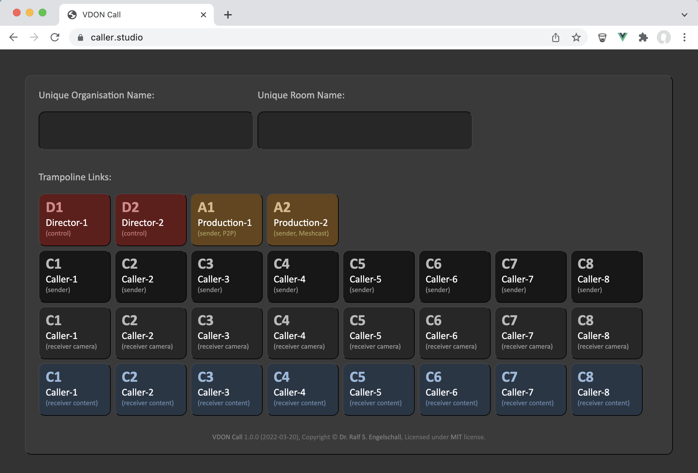
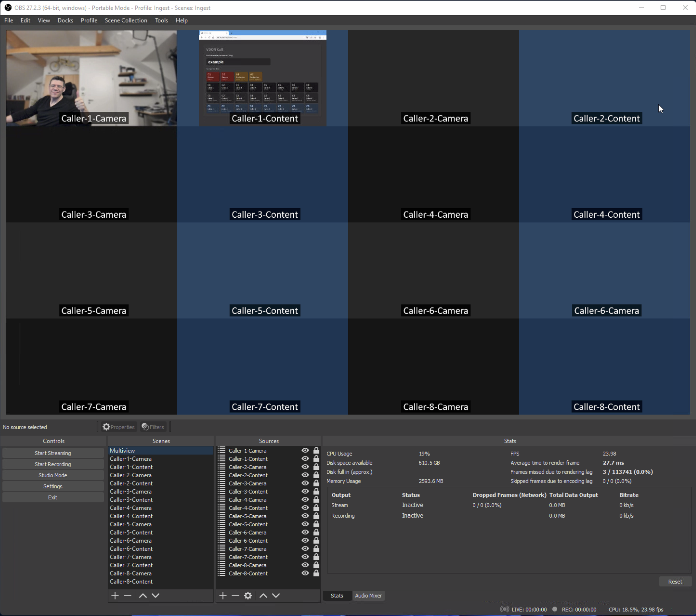
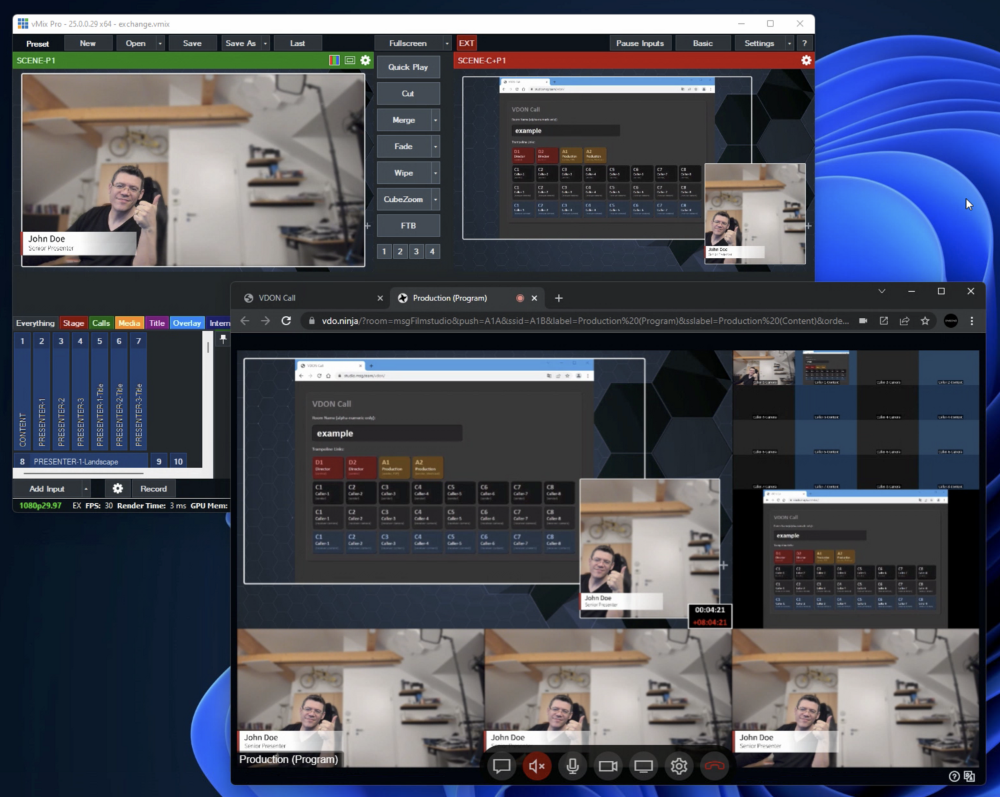
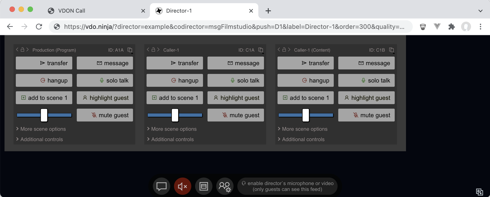

VDON Call
=========

**VDON Call** is a [WebRTC](https://en.wikipedia.org/wiki/WebRTC)/[NDI](https://ndi.tv)-based
remote caller ingest solution for live video productions, based on
the two swiss army knifes in their field: the awesome, low-latency,
P2P-based video streaming facility [VDO.Ninja](https://vdo.ninja),
and the awesome, ultra-flexible video mixing software
[OBS Studio](https://obsproject.com). An instance of the landing page, the
corresponding URL trampoline, of **VDON Call** is publically available
under the meaningful name URL [caller.studio](https://caller.studio)
(*caller of the studio*).

Motivation
----------

The name **VDON Call** (spoken *ViDeO Ninja Call*) is derived from
[vMix Call](https://www.vmix.com/products/vmix-call.aspx), the name of the
great but weaker product **VDON Call** is intended to substitute in
practice, if necessary. The motivation and primary killer feature of
**VDON Call**, in contrast to the otherwise also awesome vMix Call,
is that the callers can ingest their camera and content *in parallel*
and without having to fiddle around with two independent Browser tabs
and that this dual-ingest approach is available for 8 callers in total
instead of just 4 (because vMix Call supports a maximum of 8 incoming
video streams only). The resulting ingested video streams are available
as NDI streams on the local network and can be easily consumed (usually
on a separate computer) with a video mixing software like vMix or OBS
Studio.

Constraints
-----------

The [underlying VDO.Ninja parameterization](https://github.com/rse/vdon-call/blob/master/index.html#L368)
is very opinionated and heavily optimized for a total of 16+1 video
streams, to allow one to ingest up to 8 callers with their camera and
shared content (screen or window) into the video production and to
provide a return feed from the video production back to the callers. The
callers can hear but not see each other, except the provided return feed
is some sort of multiview and shows the callers. This is intentional,
as this is not a general video conferencing solution, but a dedicated
way to ingest remote video callers of a production. Please keep this in
mind.

There are two particular bottlenecks in this approach, which are
addressed by the particular VDO.Ninja parameterization:

1. **CALLER INGEST FEEDS**:
   
   The caller receiver-side is an OBS Studio, acting as a WebRTC-to-NDI
   gateway and has to run on a medium gaming PC (Intel Core i7 11700KF,
   NVIDIA RTX 3070Ti, 32GB RAM) with just about a maximum of about 80%
   overall resource utilization. As a result, the callers camera use
   720p24 and a bitrate of 2000 kbps with H.264 and the callers content
   use 1080p6 and a bitrate of 3000 kbps with H.264.

2. **PRODUCTION RETURN FEED**:
 
   The production sender-side, providing the return feed of the video
   production back to the caller, should require no more than half of
   the uplink (50 mbps) and downlink (100 mbps) of the usual Internet
   connections available in Germany. As a result, the return feed uses
   1080p29.97 and a bitrate of 3000 kbps with VP8.

Installation
------------

The solution consists of the following parts which have to be installed:

1. **URL TRAMPOLINE:**

   This is just the files [index.html](index.html), [vdon.css](vdon.css) and [vdon-call-logo.svg](vdon-call-logo.svg),
   which act as a URL trampoline, a
   tiny webpage which generates the underlying, heavily parameterized VDO.Ninja
   URLs. Install it as `index.html` to an arbitrary Internet service.
   The page without any attached parameters is usually only used
   by the video production crew to generate URLs. The page
   with attached parameters is used by all **VDON Call** components
   (see below) to expand the short URLs to the underlying VDO.Ninja URLs.
   For convenience reasons, an instance of this URL trampoline
   is publically available under the meaningful URL
   [caller.studio](https://caller.studio).

2. **WEBRTC-TO-NDI GATEWAY:**

   This is an OBS Studio instance, driven by the files [obs-studio/basic.ini](obs-studio/basic.ini),
   [obs-studio.json](obs-studio.json),
   [obs-studio.lua](obs-studio.lua) and
   [obs-studio.html](obs-studio.html).
   These are the OBS Studio profile, scene collection, configuration update script and
   optional entry page, which establish OBS Studio as a WebRTC-to-NDI gateway.
   For this to work, you have to locally install the following
   prerequisites:

   - [NDI Tools](https://www.ndi.tv/tools/)
   - [OBS Studio](https://obsproject.com/)
   - [OBS NDI](https://github.com/Palakis/obs-ndi/)

   Then use *Profile* &rarr; *Import* for importing the
   [obs-studio/](obs-studio/) directory. Then use *Scene Collection*
   &rarr; *Import* for importing the [obs-studio.json](obs-studio.json)
   file. Then, use *Tools* &rarr; *Scripts* &rarr; `+` for importing the
   [obs-studio.lua](obs-studio.lua) file.

   Once this is done, use *Tools* &rarr; *Scripts* &rarr;
   `obs-studio.lua` to update all browser sources in OBS Studio with
   your URL trampoline information. The "Base URL" is either `https://caller.studio/`,
   `file://<path-to-obs-studio.html>/#https://caller.studio/` (if you want to
   use the optional entry page -- usually just for debugging purposes),
   or your own URL where you deployed the URL trampoline (see above).

3. **VIDEO PRODUCTION:**

   This is the actual video production which requires a video mixing
   software like vMix or OBS Studio to consume and mix the NDI streams
   of the callers and produce a "program" (aka output) which can act
   as the return feed video stream to the callers. This really has to
   run on a computer which is separate (but in the same LAN) to the
   WebRTC-to-NDI gateway.

Components
----------

The solution consists of the following logical parts under run-time:

- **URL Trampoline**

  This is the URL trampoline which is deployed to a publically reachable
  URL like `https://caller.studio`, and which can be used by the
  production crew to easily generate the required "short" URLs based
  on unique organisation name and a room name (unique per organisation). Its
  trampoline functionality on access of these "short" URLs expand to the
  underlying, technical, heavily-parameterized VDO.Ninja URLs.

  

- **Caller (Sender)**

  This is the caller sender-side, i.e., Google Chrome opened a URL
  like `https://caller.studio/#/example/example/C1`.
  The result the VDO.Ninja user interface, configured for a caller
  participating in a room where the user can only see its own camera and
  shared content preview and the return feed of the production (here
  a multiview from vMix).
  You can also attach the following optional parameters to the URL:
    - `vdon=<key>:<val>,...` (apply arbitrary VDO.Ninja options)
    - `quality=high` (use 30/30 FPS and 3/3 Mbps instead of 24/6 FPS and 2/2 Mbps for camera/screen)
    - `codec=<id>` (use codec `x264`, `vp9`, `av1` or `webp` instead of `vp8`)
    - `cam=<name>` (camera device)
    - `mic=<name>` (microphone device)
    - `spk=<name>` (speaker device)
    - `lang=<cc>` (ISO country code for UI language)
    - `bg=<type>` (background replacement: `blur`, `green` or `canvas`)
    - `ducking` (use audio ducking/noisegate)
    - `audiodelay=<ms>` (delay audio)
    - `videodelay=<ms>` (delay video)
  An example sender URL would be
  `https://caller.studio/#/example/example/C1?cam=Standard&mic=Standard&lang=de&bg=blur`

  

- **Caller (Receiver)**

  This is the heart of the solution, the caller receiver-side,
  i.e., OBS Studio with the **VDON Call** profile and
  scene collection loaded which accesses URLs like
  `https://caller.studio/#/example/example/C1?stream=camera` and
  `https://caller.studio/#/example/example/C1?stream=content`. For an
  overview, a special multiview scene is in preview (and also exposed
  via NDI for inclusion into the multiview of the production -- see
  below).
  You can also attach the following optional parameters to the URL:
    - `vdon=<key>:<val>,...` (apply arbitrary VDO.Ninja options)
    - `quality=high` (use 30/30 FPS and 3/3 Mbps instead of 24/6 FPS and 2/2 Mbps for camera/screen)
    - `codec=<id>` (use codec `x264`, `vp9`, `av1` or `webp` instead of `vp8`)

  

- **Production (Sender)**

  This is the video production. It uses a video mixing software
  like vMix (shown here) or OBS Studio (as a decent alternative). This
  production receives all callers (and the multiview) from OBS
  Studio via NDI and mixes them into a resulting program video
  stream. For convenience reasons, beside this program video
  stream, this vMix instance also exports a multiview video stream
  which shows the caller ingest multiview, selected callers, the
  program video stream and the clock. Either the program or (as
  shown shere) the multiview video stream is then send back to the
  callers via a companion Google Chrome instance accessing the URL
  `https://caller.studio/#/example/example/A1` (standard) or
  `https://caller.studio/#/example/example/A2?mode=meshcast` (using the VDO.Ninja meshcast feature).
  Similar to the `mode=meshcast`, you can attach the following optional parameters
  to the URL:
    - `vdon=<key>:<val>,...` (apply arbitrary VDO.Ninja options)
    - `quality=high` (use 30/30 FPS and 3/3 Mbps instead of 24/6 FPS and 2/2 Mbps for camera/screen)
    - `codec=<id>` (use codec `x264`, `vp9`, `av1` or `webp` instead of `vp8`)
    - `cam=<name>` (camera device)
    - `mic=<name>` (microphone device)
    - `spk=<name>` (speaker device)
  An example URL would be
  `https://caller.studio/#/example/example/A1?cam=vMix Video External 2&mic=Line 2 (Virtual Audio Cable)`

  

- **Director (Control)**

  This is the optional VDO.Ninja director
  view, i.e., Google Chrome accessing the URL
  `https://caller.studio/#/example/example/D1`
  where the production crew can send messages to the callers, adjust the
  parameters of the callers, etc. The director view intentionally has
  all incoming video/audio feeds disabled and also does not send an own
  outgoing video/audio feed to not cause any additional network traffic
  on the callers.
  You can also attach the following optional parameters to the URL:
    - `vdon=<key>:<val>,...` (apply arbitrary VDO.Ninja options)

  

Design Cruxes
-------------

The design of **VDON Call** is based on the following cruxes:

- **OPTIMIZED VIDEO ENCODINGS**:
  The *Caller Ingest Feeds* use the video codec H.264, reduced
  resolutions (720p and 1080p), and reduced framerates (24 and 6) to
  allow the WebRTC-to-NDI gateway to cope with the decoding of 16 video
  streams and the re-encoding of 16+1 video streams. In contrast to
  this, the *Production Return Feed* uses the video codec VP8 as it
  provides better overall quality (H.264 on smaller sizes regularly
  degrades the video stream to be greyed or washed out).

- **MINIMUM TOTAL VIDEO STREAMS**:
  The *Director* mode in VDO.Ninja is forced to not use any video
  or audio at all, to reduce the minimum number of total video streams
  in the room and especially reduce the load on the callers as good
  as possible.

- **REDUCED USER INTERFAC CLUTTER:**
  The *Caller* mode in VDO.Ninja is forced to be as simple as
  possible from a user interface perspective (many features are
  intentionally disabled) to not confuse the callers as good as
  possible.

- **SIMPLE AND INTUITIVE URLS:**
  The *Caller URLs* use the meaningful "caller.studio" domain and
  are reduced to the absolute minimum of the required information.
  All technical aspects of the underlying VDO.Ninja facility are
  hidden and are provided on-the-fly by expanding the URLs internally.

- **NAMESPACE CONFLICT AVOIDANCE:**
  The VDO.Ninja room identifiers and stream identifiers are based
  on the hashing of an organization and room name. This way **VDON
  Call** does not "trash" the namespace of VDO.Ninja too much and is
  less likely in conflict with regular VDO.Ninja uses.

- **USER INTERFACE STYLING:**
  The VDO.Ninja user interface, especially the entry page for selecting
  devices and the chat module, in dark mode and by default look rather
  unpolished. For an improved user acceptance, the appearance of the
  user interface of VDO.Ninja is improved with a VDON Call specific
  style.

See Also
--------

This solution was announced 2022/03 in the following communities:

- [Reddit: VDO.Ninja](https://www.reddit.com/r/VDONinja/comments/ti8jz4/vdon_call_remote_caller_ingest_via_vdoninja_to/)
- [Reddit: OBS Studio](https://www.reddit.com/r/obs/comments/tihbxz/vdon_call_external_ndibased_remote_caller_ingest/)
- [Reddit: vMix](https://www.reddit.com/r/vmix/comments/ti8r3g/vdon_call_remote_caller_ingest_via_vdoninja_obs/)
- [vMix: vMix Call](https://forums.vmix.com/posts/t28731-VDON-Call--a-vMix-Call-substitute--when-parallel-camera-and-screen-sharing-is-required)
- [Twitter: Engelschall](https://twitter.com/engelschall/status/1505340731593998339)

Copyright & License
-------------------

Copyright &copy; 2022 [Dr. Ralf S. Engelschall](mailto:rse@engelschall.com) 
Licensed under [MIT](https://spdx.org/licenses/MIT)

